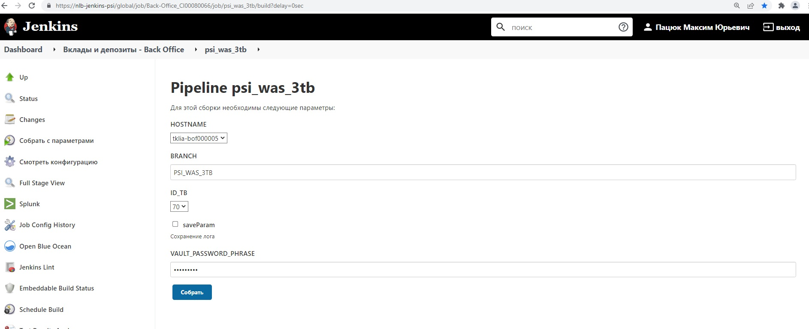

# groovy - backend for Jenkins

I developed and configured user-friendly Jenkins-job via XML config and Groovy to automate resource cleanup on remote hosts:

Business Value:
Previously, resource cleanup on remote hosts had to be manually performed by developers and takes them time and distracting from tasks, but now any user with system administrator grants can handle it through the Jenkins job. I automated the process by providing a dropdown list to select the desired hosts, each of which fit into one of the territorial areas of the bank. The business value of this project is clear, as it allowed the company to reduce vendor resources from 12 hosts to just 3, resulting in a 75% reduction in paid cloud capacity used. The risk of human error has been reduced as well.

I also participate in writing Python(Jython for IBM) scripts and add functionality to enable/disable logging, but that was not my primary focus.

Stack: Groovy◦ Jenkins◦ XML◦ IBM WebSphere Application Server
